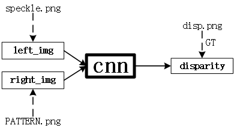
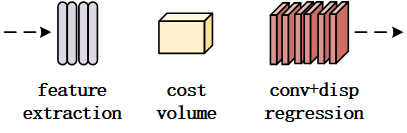

# Speckled Depth Estimation using CNN
> The experiments were conducted on speckle dataset. Especially, this work mainly were experimented on the [primesense](https://github.com/TheDetial/Make-Your-Active-Data) dataset.

## Data preparation
The details please refer to [Make-Your-Active-Data](https://github.com/TheDetial/Make-Your-Active-Data).  

## Data-Type
(1)speckled images  
(2)stereo or structured light images

## Table of Contents
- [datasets](#datasets) 
- [models](#models)  
- [test](#test)  
- [utils](#utils)
- `test.py`
- `train.py`

## Dependencies
+ PyTorch (0.4.0+)
+ Python (3.5.0+)
+ cudatoolkit(9.0+)
+ torchvision (0.2.0+)
+ tensorboard (1.6.0)
+ pillow

## Training
1.The advantage of using virtual data is that there are GT available for model training. The structured light camera was regarded as binocular camera system for stereo matching. `speckle.png` and `PATTERN.png` were taken as `left_img` and `right_img` respectively. Otherwise, `disp.png` was taken as Ground Truth for model training.  
  
2.The cnn model mainly consists of feature extraction, matching cost calculation and disparity regression.
  
I will not introduce the specific details for cnn here. Please refer to the relevant papers for understanding.  
3.please run the `train.py` for training the cnn model. This cnn model was named `dcnn-model` by me, you can see it in `dcnn_model_v1.py`. 

## Test
You can run the `test.py` to get the predicted `disp.png` or predicted `depth.png`. I also provide one pre-trained model `checkpoint_20_0174000.tar` in `test` sub-directory.

## Results
In `test/results` directory, I give you two examples tested on primesense camera sepckle images. The original images with a big size of `1280*1024`, so you need a powerful GPU resource. I also provide you a croped face-cloud in `result2` obtained by my `dcnn-model`, this face 3d-point cloud is very smooth, no extra noise and the facial features are obvious.

## Acknowledgement
This work is mainly inspired by **[Connecting_the_Dots](https://github.com/autonomousvision/connecting_the_dots)**, **[ActiveStereoNet](http://asn.cs.princeton.edu/)**, **[PSMNet](https://github.com/JiaRenChang/PSMNet)** and **[GwcNet](https://github.com/xy-guo/GwcNet)**.

